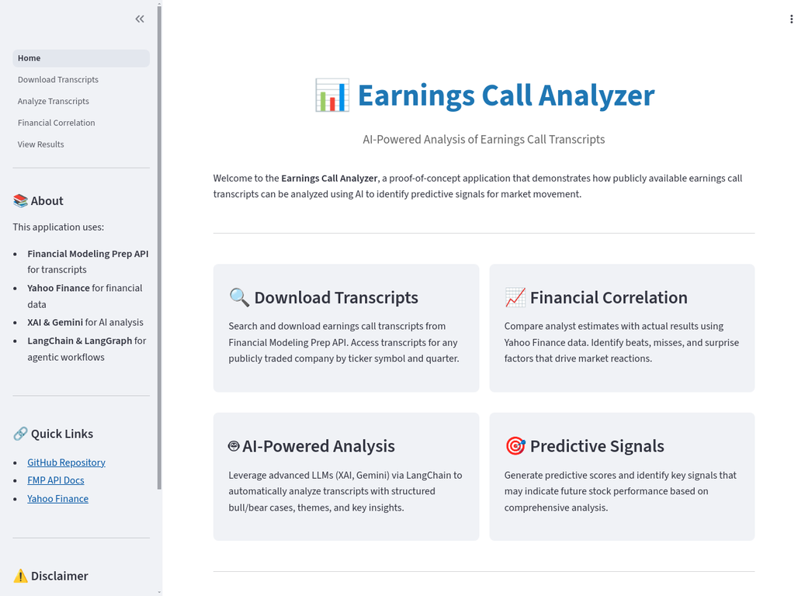
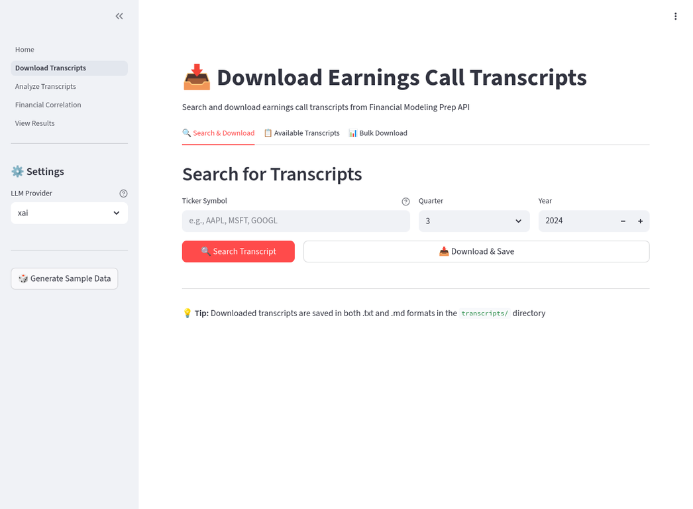
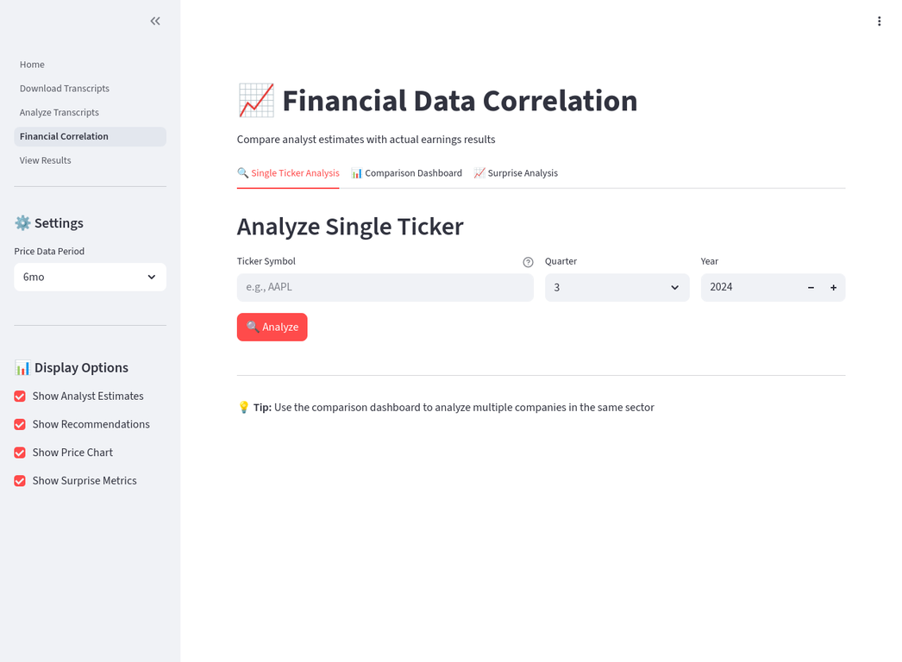
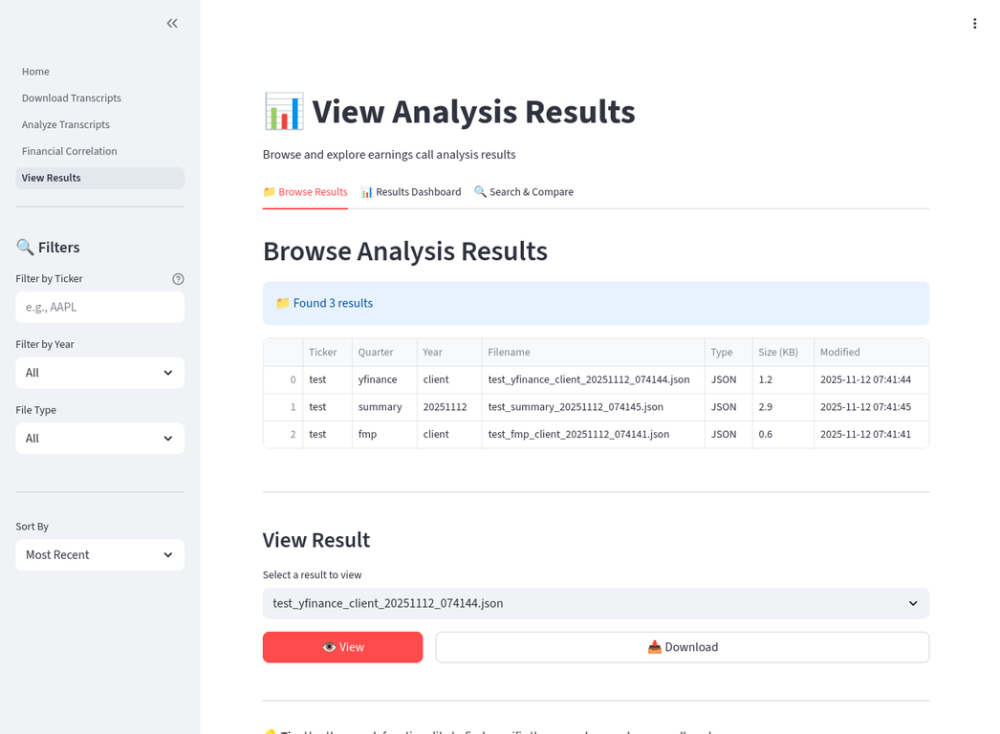

# Earnings Call Analyzer - User Guide

## Overview

The **Earnings Call Analyzer** is a comprehensive Streamlit-based application that leverages AI to analyze earnings call transcripts and identify predictive signals for market movement. This guide will walk you through all features and functionality.

---

## Table of Contents

1. [Getting Started](#getting-started)
2. [Home Page](#home-page)
3. [Download Transcripts](#download-transcripts)
4. [Analyze Transcripts](#analyze-transcripts)
5. [Financial Correlation](#financial-correlation)
6. [View Results](#view-results)
7. [Tips and Best Practices](#tips-and-best-practices)
8. [Troubleshooting](#troubleshooting)

---

## Getting Started

### Prerequisites

- Python 3.11+
- API Keys configured in `.env` file:
  - `XAI_API_KEY` - For XAI LLM access
  - `GOOGLE_API_KEY` - For Gemini LLM access
  - `FMP_API_KEY` - For Financial Modeling Prep API

### Installation

```bash
# Clone the repository
git clone https://github.com/kaljuvee/earnings-calls.git
cd earnings-calls

# Install dependencies
pip install -r requirements.txt

# Configure environment variables
cp .env.sample .env
# Edit .env with your API keys

# Run the application
streamlit run Home.py
```

The application will open in your default browser at `http://localhost:8501`

---

## Home Page



The home page provides an overview of the application and displays:

### Features Overview

- **🔍 Download Transcripts** - Access earnings call transcripts from FMP API
- **🤖 AI-Powered Analysis** - Automated analysis using XAI and Gemini
- **📈 Financial Correlation** - Compare estimates vs actual results
- **🎯 Predictive Signals** - Generate predictive scores

### System Status

The home page shows the configuration status:
- ✅ API keys configured
- 📁 Number of transcripts available

### Navigation

Use the sidebar to navigate between pages:
- Home
- Download Transcripts
- Analyze Transcripts
- Financial Correlation
- View Results

---

## Download Transcripts



This page allows you to search and download earnings call transcripts from the Financial Modeling Prep API.

### Features

#### 🔍 Search & Download Tab

**Single Transcript Download:**

1. **Enter Ticker Symbol** - Type the stock ticker (e.g., AAPL, MSFT, GOOGL)
2. **Select Quarter** - Choose Q1, Q2, Q3, or Q4
3. **Enter Year** - Specify the year (2020-2025)
4. **Click "🔍 Search Transcript"** - Search for the transcript
5. **Review Preview** - View a preview of the transcript content
6. **Click "📥 Download & Save"** - Save the transcript to the `transcripts/` directory

**Output:**
- Transcripts are saved in both `.txt` and `.md` (Markdown) formats
- Files are named: `{TICKER}_Q{QUARTER}_{YEAR}.md`

#### 📋 Available Transcripts Tab

View all downloaded transcripts:
- Browse transcripts in a table format
- See ticker, quarter, year, filename, and file size
- Select and view any transcript
- Full transcript content displayed in Markdown format

#### 📊 Bulk Download Tab

Download multiple transcripts at once:

1. **Enter Tickers** - Type ticker symbols, one per line
2. **Select Quarter** - Choose the quarter for all tickers
3. **Enter Year** - Specify the year for all tickers
4. **Click "📥 Download All"** - Start bulk download
5. **Monitor Progress** - Progress bar shows download status
6. **Review Results** - See success/failure status for each ticker

**Example:**
```
AAPL
MSFT
GOOGL
AMZN
TSLA
```

### Settings (Sidebar)

- **LLM Provider** - Select XAI or Gemini (for future analysis)
- **🎲 Generate Sample Data** - Generate synthetic data for testing

---

## Analyze Transcripts


This page runs AI-powered analysis on downloaded transcripts using LangChain and LangGraph.

### Features

#### 📝 Single Analysis Tab

**Steps:**

1. **Select Transcript** - Choose from available transcripts
2. **Review Metadata** - View ticker, quarter, and year
3. **Preview Transcript** - Expand to see transcript content
4. **Configure Settings** (Sidebar):
   - **LLM Provider** - Choose XAI or Gemini
   - **Analysis Type** - Standard Analysis, Agentic Workflow, or Quick Summary
   - **Analysis Options**:
     - ✅ Include Sentiment Analysis
     - ✅ Include Predictive Signals
     - ✅ Include Financial Context
   - **Temperature** - Adjust creativity (0.0-1.0)
5. **Click "🚀 Run Analysis"** - Start the analysis

**Analysis Types:**

- **Standard Analysis** - Single-pass comprehensive analysis
- **Agentic Workflow** - Multi-step analysis using LangGraph with:
  - Main earnings analysis
  - Sentiment analysis
  - Predictive signals
  - Compiled final report
- **Quick Summary** - Fast overview analysis

**Output Structure:**

The analysis follows a structured template:

```markdown
# {TICKER} Q{QUARTER} {YEAR} earnings: [Summary]

[Opening paragraph with key highlights]

## 🐂 The Bull Case
[Positive arguments and growth metrics]

## 🐻 The Bear Case
[Concerns and risks]

## ⚖️ Verdict
[Balanced assessment]

## Themes, Drivers, and Concerns
🟢 Positive Theme
🟡 Neutral/Mixed Theme
🔴 Negative Theme
⚪ New/Emerging Theme

## Main Financials (Q{QUARTER} {YEAR})
* Revenue, margins, key metrics with YoY comparisons

## Guidance (Full Year {YEAR})
🟢 Raised guidance
🔴 Lowered guidance
⚪ Maintained guidance

## Main Questions for the Earnings Call
1. Strategic questions
2. Competitive dynamics
3. Financial sustainability
4. Execution risks
```

**Results:**
- Analysis displayed on screen
- Automatically saved to `test-results/` directory
- Download button to save as Markdown file

#### 🔄 Batch Analysis Tab

Analyze multiple transcripts simultaneously:

1. **Select Transcripts** - Choose multiple transcripts from the list
2. **Configure Settings** - Same options as single analysis
3. **Click "🚀 Run Batch Analysis"** - Start processing
4. **Monitor Progress** - Progress bar shows status
5. **Review Summary** - Table showing success/failure for each transcript

**Use Cases:**
- Analyze all transcripts for a specific quarter
- Compare multiple companies in the same sector
- Process historical transcripts for trend analysis

#### 📊 View Results Tab

Browse previously saved analysis results:
- List of all analysis files (`.md` and `.json`)
- Select and view any result
- Full analysis displayed with formatting

---

## Financial Correlation



This page correlates earnings call analysis with financial data from Yahoo Finance.

### Features

#### 🔍 Single Ticker Analysis Tab

**Comprehensive Financial Analysis:**

1. **Enter Ticker Symbol** - Type the stock ticker
2. **Select Quarter and Year** - Choose the period
3. **Click "🔍 Analyze"** - Fetch financial data

**Data Displayed:**

**Company Overview:**
- Sector and Industry
- Market Capitalization
- Current Stock Price

**📊 Analyst Estimates:**
- Earnings estimates (EPS)
- Revenue estimates
- Comparison tables with historical data

**⭐ Analyst Recommendations:**
- Recent recommendations from analysts
- Recommendation grade distribution (Buy, Hold, Sell)
- Number of firms covering the stock
- Visual chart of recommendation grades

**📈 Price Performance:**
- Interactive candlestick chart
- Configurable time period (1mo, 3mo, 6mo, 1y, 2y)
- Price statistics:
  - Current price
  - Period return percentage
  - High and low prices

**🎯 Earnings Surprise Metrics:**
- Average surprise percentage
- Beat rate (percentage of quarters beating estimates)
- Maximum and minimum surprises
- Beat/Miss/Meet breakdown

**📄 Full Correlation Report:**
- Click "Generate Full Correlation Report"
- Comprehensive report combining all data
- Download as Markdown file

#### 📊 Comparison Dashboard Tab

Compare multiple tickers side by side:

1. **Enter Tickers** - Comma-separated list (e.g., "AAPL, MSFT, GOOGL")
2. **Click "📊 Compare Tickers"** - Generate comparison
3. **Review Table** - See all metrics in one view:
   - Company name and sector
   - Market cap and current price
   - Average surprise percentage
   - Beat rate

**Use Cases:**
- Sector analysis
- Peer comparison
- Portfolio screening

#### 📈 Surprise Analysis Tab

Analyze historical earnings surprises:

1. **Enter Ticker Symbol** - Type the stock ticker
2. **Click "📊 Analyze Surprises"** - Generate charts

**Visualizations:**

- **Earnings Surprise History** - Bar chart showing surprise % for each quarter
  - Green bars = Beat estimates
  - Red bars = Missed estimates
  
- **Estimate vs Actual Chart** - Line chart comparing:
  - Blue dashed line = Analyst estimates
  - Green solid line = Actual results

- **Detailed Data Table** - Complete surprise data with dates

### Settings (Sidebar)

**Price Data Period:**
- 1mo, 3mo, 6mo, 1y, 2y

**Display Options:**
- ✅ Show Analyst Estimates
- ✅ Show Recommendations
- ✅ Show Price Chart
- ✅ Show Surprise Metrics

---

## View Results



This page allows you to browse, search, and compare all analysis results.

### Features

#### 📁 Browse Results Tab

**Filter and Sort Results:**

**Filters (Sidebar):**
- **Filter by Ticker** - Enter ticker symbol
- **Filter by Year** - Select specific year or "All"
- **File Type** - Markdown (.md), JSON (.json), or All
- **Sort By** - Most Recent, Oldest First, Ticker (A-Z), Ticker (Z-A)

**Results Table:**
- Ticker, Quarter, Year
- Filename and file type
- File size and modification date

**View Results:**
1. Select a result from the dropdown
2. Click "👁️ View" - Display full content
3. Click "📥 Download" - Download the file

**Display:**
- **JSON files** - Structured view with metadata and results sections
- **Markdown files** - Rendered Markdown with formatting

#### 📊 Results Dashboard Tab

**Statistics Overview:**

**Metrics:**
- Total number of results
- Markdown files count
- JSON files count
- Total storage size

**Charts:**
- **Results by Ticker** - Bar chart showing analysis count per ticker
- **Results by Year** - Bar chart showing analysis count per year

**Recent Results:**
- Table of 10 most recent analyses
- Ticker, filename, and modification date

#### 🔍 Search & Compare Tab

**Search Functionality:**

1. **Enter Keywords** - Type search terms
2. **View Results** - See all files containing the keywords
3. **Review Context** - Preview text around matches
4. **View Full File** - Click to see complete content

**Compare Analyses:**

1. **Select First Result** - Choose from dropdown
2. **Select Second Result** - Choose another result
3. **Click "🔄 Compare"** - View side-by-side
4. **Review Differences** - Compare analyses visually

**Use Cases:**
- Find specific themes across multiple analyses
- Compare bull/bear cases for different quarters
- Track how sentiment changes over time
- Identify recurring concerns or opportunities

---

## Tips and Best Practices

### Downloading Transcripts

1. **Check Availability** - Not all quarters may have transcripts available
2. **Recent Quarters** - Focus on Q3 and Q4 2024 for best availability
3. **Bulk Download** - Use for sector analysis or portfolio screening
4. **API Limits** - FMP free tier has 250 calls/day limit

### Running Analysis

1. **Choose the Right Analysis Type:**
   - **Standard Analysis** - Fast, comprehensive, good for most use cases
   - **Agentic Workflow** - Detailed, multi-perspective, best for deep analysis
   - **Quick Summary** - Fast overview when time is limited

2. **LLM Provider Selection:**
   - **XAI (Default)** - Good balance of speed and quality
   - **Gemini** - Alternative option, may have different insights

3. **Include Financial Context:**
   - Always enable for better analysis quality
   - Provides analyst estimates and market context
   - Helps identify beats/misses

4. **Temperature Setting:**
   - **0.0-0.3** - More focused and factual
   - **0.4-0.7** - Balanced (recommended)
   - **0.8-1.0** - More creative and exploratory

### Financial Correlation

1. **Use All Display Options** - Enable all checkboxes for comprehensive view
2. **Compare Peers** - Use comparison dashboard for sector analysis
3. **Track Surprises** - Historical surprise data shows company's track record
4. **Generate Reports** - Download correlation reports for offline analysis

### Managing Results

1. **Organize by Ticker** - Use filters to focus on specific companies
2. **Search for Themes** - Find recurring topics across analyses
3. **Compare Over Time** - Track how analysis changes quarter-over-quarter
4. **Export Results** - Download important analyses for presentations

---

## Troubleshooting

### Common Issues

**Issue: "No transcripts available"**
- Solution: Download transcripts first using the Download Transcripts page
- Check if the transcript exists for that ticker/quarter/year

**Issue: "API Key not configured"**
- Solution: Check `.env` file has correct API keys
- Restart Streamlit after updating `.env`

**Issue: "403 Forbidden" from FMP API**
- Solution: Check API key validity
- Verify you haven't exceeded daily rate limit (250 calls/day)
- Try again after some time

**Issue: "Analysis failed"**
- Solution: Check transcript file exists and is readable
- Verify LLM API keys are valid
- Try with a different LLM provider
- Check error message in the application

**Issue: "No financial data available"**
- Solution: Yahoo Finance may not have data for that ticker
- Try a different, more liquid stock
- Check ticker symbol is correct

**Issue: "Module not found" errors**
- Solution: Reinstall dependencies: `pip install -r requirements.txt`
- Check Python version is 3.11+

### Performance Tips

1. **Batch Processing** - Use batch analysis for multiple transcripts
2. **Cache Results** - Results are automatically saved, reuse them
3. **Filter Results** - Use filters to reduce data loading time
4. **Close Unused Tabs** - Keep only active tabs open in browser

### Getting Help

- **GitHub Issues**: [https://github.com/kaljuvee/earnings-calls/issues](https://github.com/kaljuvee/earnings-calls/issues)
- **Documentation**: Check README.md in the repository
- **API Documentation**:
  - [FMP API Docs](https://site.financialmodelingprep.com/developer/docs)
  - [Yahoo Finance](https://finance.yahoo.com)

---

## Advanced Features

### Custom Analysis Prompts

The analysis prompts are stored in `prompts/analysis_prompt.py`. You can customize:
- Analysis structure and sections
- Emoji indicators
- Question types
- Output format

### Extending the Application

The modular structure allows easy extension:

- **Add new data sources** - Create new client in `utils/`
- **Add new analysis types** - Extend `llm_client.py`
- **Add new pages** - Create new file in `pages/`
- **Add new visualizations** - Use Plotly in correlation pages

### Testing

Run the test suite to verify functionality:

```bash
cd tests
python run_all_tests.py
```

Individual tests:
```bash
python test_fmp_client.py
python test_yfinance_client.py
```

---

## Conclusion

The Earnings Call Analyzer provides a comprehensive toolkit for analyzing earnings calls with AI-powered insights. By combining transcript analysis, financial data correlation, and predictive signals, it helps identify potential market opportunities and risks.

**Key Takeaways:**
- Download transcripts from FMP API
- Run AI-powered analysis with structured output
- Correlate with financial data from Yahoo Finance
- Track results and compare over time
- Generate comprehensive reports

**Next Steps:**
1. Download transcripts for companies you're interested in
2. Run analyses to understand earnings dynamics
3. Compare with analyst estimates and recommendations
4. Track predictive signals for investment decisions

---

**Disclaimer:** This application is for educational and research purposes only. It does not constitute financial advice. Always conduct your own research and consult with financial professionals before making investment decisions.

---

*Lohusalu Capital Management*
